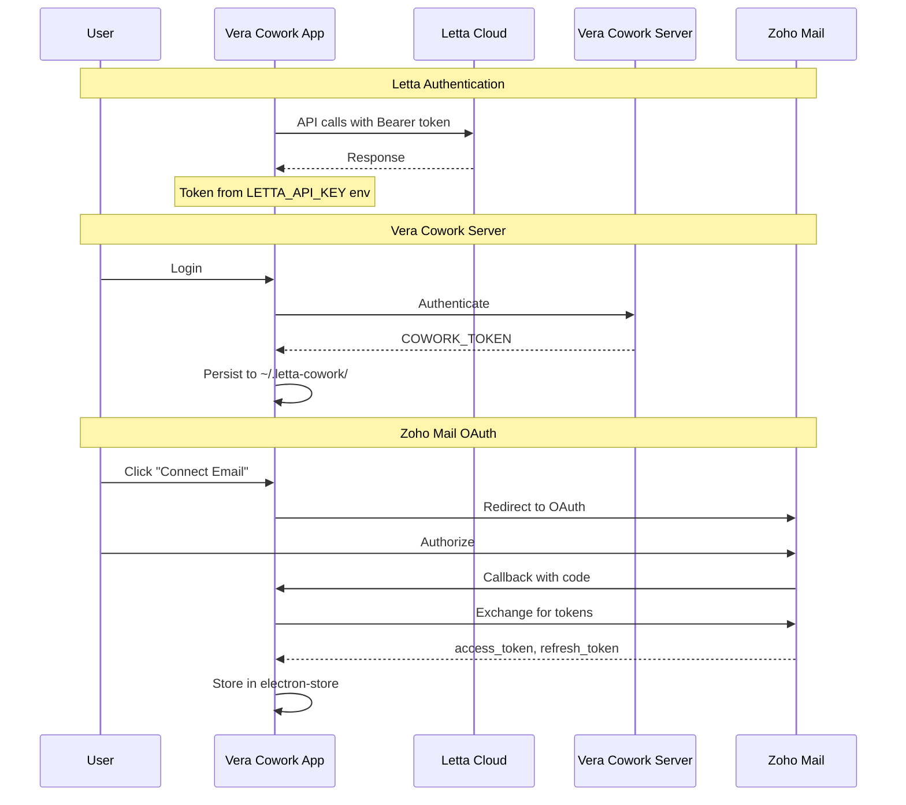
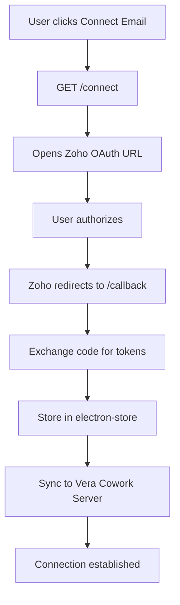
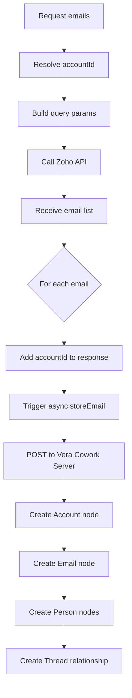
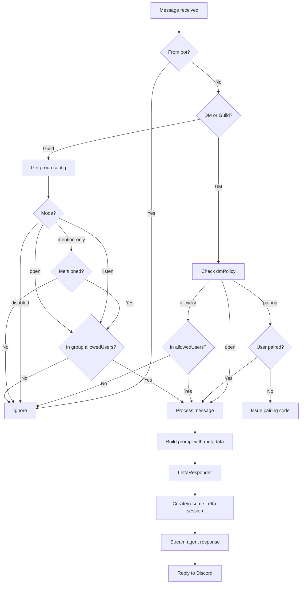
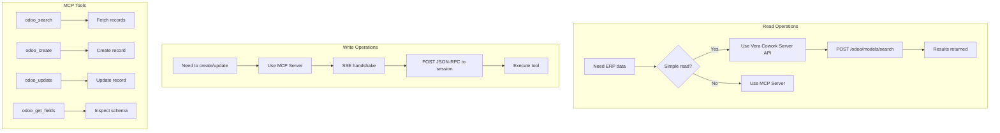
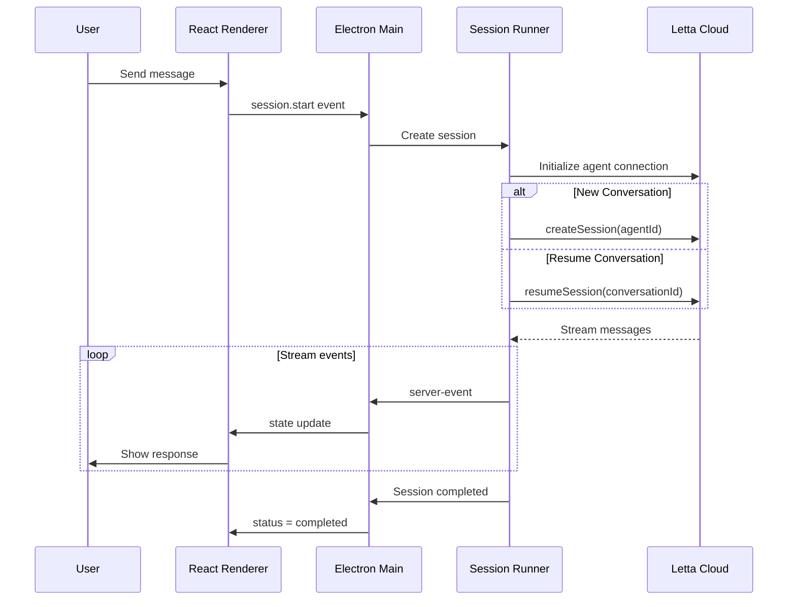

# Vera Cowork Functional Overview

**Vera Cowork** is an Electron + React desktop application that serves as your command center for Letta AI agents. It unifies agent conversations, email workflows, and messaging channels into a single, cohesive interface.

---

## What You Can Do with Vera Cowork

| Capability | Description |
|------------|-------------|
| **Chat with Agents** | Interactive sessions with Letta agents that remember across conversations |
| **Manage Emails** | Connect Zoho Mail accounts, fetch emails, and route them to agents |
| **Bridge Channels** | Connect Discord, WhatsApp, Telegram, and Slack to your agents |
| **Access Business Data** | Query Odoo ERP records and Neo4j email graphs |
| **Organize Conversations** | Persistent sessions with full conversation history |

---

## Architecture Overview

```
┌─────────────────────────────────────────────────────────────────┐
│                     React User Interface                        │
│          Components, Hooks, Zustand Store                        │
└───────────────────────┬─────────────────────────────────────────┘
                        │ IPC Bridge (preload)
                        ▼
┌─────────────────────────────────────────────────────────────────┐
│                   Electron Main Process                          │
├─────────────────────────────────────────────────────────────────┤
│  Bridges          │  Email Server     │  API Clients            │
│  Discord          │  Express          │  Letta SDK              │
│  WhatsApp         │  localhost:4321   │  Vera Cowork Server     │
│  Telegram         │  Zoho Mail API    │  Neo4j / Odoo           │
│  Slack            │  PDF Converter    │                         │
└───────────────────────┬─────────────────────────────────────────┘
                        │
        ┌───────────────┼───────────────┬───────────────┐
        ▼               ▼               ▼               ▼
┌──────────────┐ ┌──────────────┐ ┌──────────────┐ ┌──────────────┐
│ Letta Cloud  │ │ Zoho Mail    │ │ Neo4j        │ │ Odoo ERP     │
│ Agent Memory │ │ OAuth API    │ │ Email Graph  │ │ via MCP      │
└──────────────┘ └──────────────┘ └──────────────┘ └──────────────┘
```

**Key Directories**

| Path | Purpose |
|------|---------|
| `src/electron/` | Main process, IPC handlers, bridges, email server |
| `src/ui/` | React renderer components and hooks |
| `skills/` | Agent-facing documentation and guides |
| `src/electron/emails/express/` | Local Express API server |

---

## Authentication

Vera Cowork handles authentication across three services, each with its own token lifecycle.

### Authentication Flow



### Token Reference

| Service | Token Source | Auth Header | Storage |
|---------|--------------|-------------|---------|
| Letta Cloud | `LETTA_API_KEY` env var | `Bearer xxx` | `.env` file |
| Vera Cowork Server | Login flow | `Bearer xxx` | `~/.letta-cowork/.cowork-token` |
| Zoho Mail | OAuth flow | `Zoho-oauthtoken xxx` | electron-store |

### Token Lifecycle Notes

- **Letta**: Static API key configured via environment variable
- **Vera Cowork Server**: Token persists to disk and shell env; re-login required on 401
- **Zoho Mail**: Access tokens auto-refresh; cleared on refresh failure requiring reconnection

---

## Email Integration

Vera Cowork connects to Zoho Mail, fetches emails, and stores them in Neo4j for agent access.

### Email Connect & OAuth Flow



### Email Fetch Flow



### Email Storage: Neo4j Graph

Emails are stored as a relationship graph in Neo4j:

```
┌─────────────┐      HAS_EMAIL      ┌─────────────┐
│   Account   │────────────────────▶│    Email    │
└─────────────┘                     └──────┬──────┘
                                          │
                        ┌─────────────────┼─────────────────┐
                        │ IN_THREAD       │ TO              │ SENT
                        ▼                 ▼                 ▼
                 ┌─────────────┐   ┌─────────────┐   ┌─────────────┐
                 │   Thread    │   │   Person    │◀──│   Person    │
                 └─────────────┘   │ (recipient) │   │  (sender)   │
                                   └─────────────┘   └─────────────┘
```

**Query Examples**

```cypher
-- Get emails for an account
MATCH (a:Account {accountId: $accountId})-[:HAS_EMAIL]->(e:Email)
RETURN e

-- Get sender of an email
MATCH (p:Person)-[:SENT]->(e:Email {messageId: $messageId})
RETURN p

-- Get full context for an email
MATCH (e:Email {messageId: $messageId})
OPTIONAL MATCH (a:Account)-[:HAS_EMAIL]->(e)
OPTIONAL MATCH (p:Person)-[:SENT]->(e)
OPTIONAL MATCH (e)-[:TO]->(r:Person)
OPTIONAL MATCH (e)-[:IN_THREAD]->(t:Thread)
RETURN e, a, p, collect(r) as recipients, t
```

### Email API Endpoints

| Endpoint | Purpose |
|----------|---------|
| `GET /connect` | Initiate Zoho OAuth |
| `GET /callback` | OAuth callback handler |
| `GET /fetchAccount` | List Zoho accounts |
| `GET /fetchFolders` | List folders for account |
| `GET /fetchEmails` | Fetch paginated email list |
| `GET /fetchEmailById` | Get full email content |
| `GET /searchEmails` | Search by query |
| `GET /downloadAttachment` | Download and upload attachments |

---

## Discord Integration

Discord messages flow through the bridge into Letta agents, with configurable policies for DMs and groups.

### Discord Inbound Flow



### DM Policies

| Policy | Behavior |
|--------|----------|
| `open` | All users can DM the bot |
| `pairing` | Users must pair via 6-character code approved by admin |
| `allowlist` | Only users in `allowedUsers` array can DM |

### Group Modes

| Mode | Behavior |
|------|----------|
| `open` | Bot responds to all messages |
| `listen` | Process for memory, respond when mentioned |
| `mention-only` | Only respond when bot is mentioned |
| `disabled` | Ignore all messages in group |

### Configuration Hierarchy

Group configs are checked in this order:
1. Channel-specific: `config.groups[channelId]`
2. Server-wide: `config.groups[guildId]`
3. Default: `config.groups["*"]`

---

## Odoo Integration

Access Odoo ERP data through Vera Cowork server (read-only) or MCP server (full CRUD).

### Odoo Flow



### Supported Operations

| Method | Service | Description |
|--------|---------|-------------|
| Read (simple) | Vera Cowork Server | `POST /odoo/models/search` with `COWORK_TOKEN` |
| Read (advanced) | MCP Server | `odoo_search`, `odoo_count`, `odoo_group` |
| Write | MCP Server | `odoo_create`, `odoo_update`, `odoo_delete` |
| Schema | MCP Server | `odoo_get_models`, `odoo_get_fields` |

### Common Odoo Models

| Model | Description |
|-------|-------------|
| `res.partner` | Customers and contacts |
| `crm.lead` | CRM leads and opportunities |
| `sale.order` | Sales orders |
| `account.move` | Invoices |
| `product.product` | Products |
| `hr.employee` | Employees |

### Recommended Workflow

1. Start with Vera Cowork Server API for reads (simpler auth)
2. Use `odoo_get_models` if unsure which model to use
3. Use `odoo_get_fields` to inspect available fields
4. Only use write tools when explicitly creating or updating records

---

## Sessions & Agent Interaction

Each chat with an agent creates or resumes a session, streaming responses back to the UI.

### Session Flow



### Session Lifecycle

| Status | Meaning |
|--------|---------|
| `idle` | No active session |
| `running` | Session actively streaming |
| `completed` | Session finished successfully |
| `error` | Session failed |

### Key Concepts

| Term | Description |
|------|-------------|
| **Agent** | Persistent entity with memory that survives across sessions |
| **Conversation** | A message thread within an agent (has `conversationId`) |
| **Session** | A single execution/connection (has `sessionId`) |

Agents remember across conversations via memory blocks, but each conversation maintains its own message history.

---

## Important Operational Notes

### Email Pipeline

- Polling-based sync (every minute for unread emails)
- Rendered-driven, not a background service
- Emails marked read only after Letta session completes successfully
- **Not yet implemented**: Retry policy, dead-letter queue, durable state machine

### Attachment Handling

- Zoho API requires `Zoho-oauthtoken` header (not `Bearer`)
- PDFs are converted to markdown for agent processing
- Upload errors don't fail the parent operation (graceful degradation)

### Token Refresh

- Zoho tokens auto-refresh on 401 or `INVALID_TICKET` error
- Failed refresh clears tokens, requiring user to reconnect

### Discord Quirks

- Long messages (>2000 chars) are split into chunks
- Mention detection: `content.includes(<@{botId}>)`

### Environment Security

- Never expose `LETTA_API_KEY` in logs or docs
- Local Letta server ignores `LETTA_API_KEY` (can use `dummy`)

---

## Quick Reference: Endpoints

### Local Email Server (`localhost:4321`)

| Endpoint | Purpose |
|----------|---------|
| `GET /fetchAccount` | List Zoho accounts |
| `GET /fetchFolders` | List folders |
| `GET /fetchEmails` | List emails (paginated) |
| `GET /fetchEmailById` | Get full email content |
| `GET /searchEmails` | Search emails |
| `GET /downloadAttachment` | Download attachments |
| `POST /neo4j/runReadQuery` | Execute Neo4j query |

### Vera Cowork Server (`vera-cowork-server.ngrok.app`)

| Endpoint | Purpose |
|----------|---------|
| `GET /channels` | List channels |
| `POST /channels/{id}/start` | Start channel runtime |
| `GET /channels/{id}/messages` | Message logs |
| `POST /odoo/models/search` | Search Odoo records |
| `POST /odoo/models/count` | Count Odoo records |
| `POST /neo4j/runReadQuery` | Neo4j read query |

### Letta Cloud API (`api.letta.com`)

| Endpoint | Purpose |
|----------|---------|
| `GET /v1/agents` | List agents |
| `POST /v1/agents/{id}/messages` | Send message to agent |
| `GET /v1/agents/{id}/core-memory/blocks` | Get memory blocks |
| `POST /v1/agents/{id}/archival-memory` | Create archival memory |

---

*Last updated: 2026-04-09*
