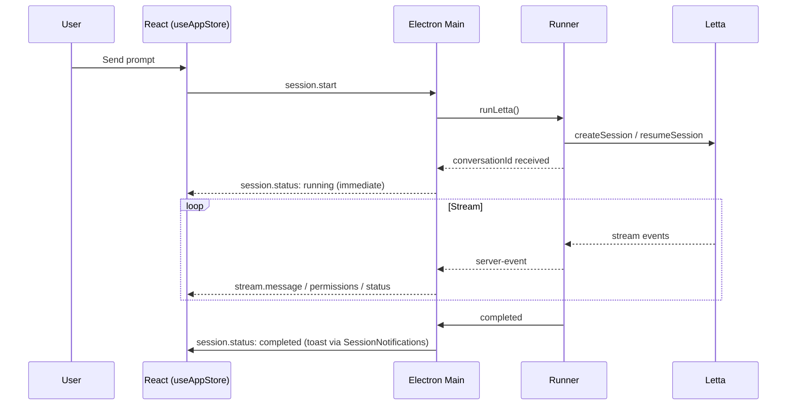
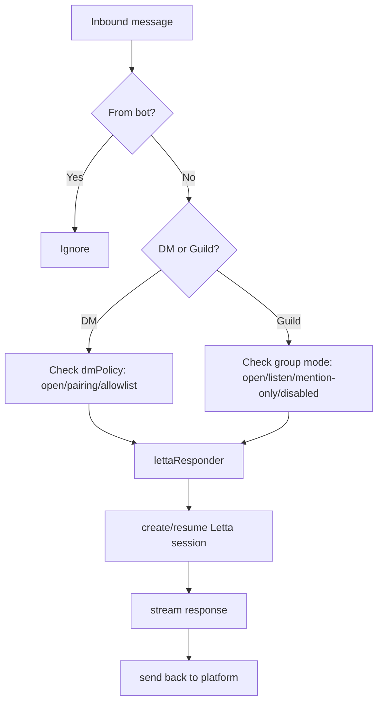

# Vera Cowork — Functional Overview

**Vera Cowork** is an Electron + React desktop application that acts as a command center for Letta Code agents. It unifies agent chat, email ingestion, messaging bridges, scheduled automations, and business-data skills into one cohesive workspace.

*Last updated: 2026-04-17*
*Version: 0.7.1*
*Stack: Electron 41 · React 19 · Vite 8 · TypeScript 6 · Tailwind 4 · Zustand 5 · node-cron*

---

## 1. What You Can Do

| Capability | Description |
|---|---|
| **Chat with Agents** | Interactive Letta sessions with persistent memory across conversations |
| **Manage Emails** | Connect Zoho Mail, fetch, search, auto-sync unread into agents |
| **Bridge Channels** | Discord, WhatsApp, Telegram, Slack → Letta agents |
| **Schedule Agent Runs** | Recurring (cron) and one-off agent executions with run history |
| **Access Business Data** | Query Odoo ERP and Neo4j email graph via skills/MCP |
| **Approve Agent Actions** | In-UI permission requests with allow/deny/always controls |
| **Install Skills** | Downloadable agent-facing skill packs |
| **Session Notifications** | Toast alerts when background sessions complete |

---

## 2. High-Level Architecture

```
┌─────────────────────────────────────────────────────────────────┐
│                     React Renderer (src/ui/)                    │
│  App.tsx · features/* · hooks · Zustand (useAppStore)           │
└──────────────────────────┬──────────────────────────────────────┘
                           │ window.electron (preload IPC bridge)
                           ▼
┌─────────────────────────────────────────────────────────────────┐
│              Electron Main Process (src/electron/)              │
│  main/ · ipc/handlers/ · api/ · services/ · bridges/ · emails/  │
└──┬────────────────┬──────────────┬──────────────┬───────────────┘
   ▼                ▼              ▼              ▼
┌──────────┐ ┌──────────┐   ┌──────────┐   ┌──────────────┐
│ Letta    │ │ Zoho     │   │ Channels │   │ Vera Cowork  │
│ Cloud    │ │ Mail     │   │ (DC/WA/  │   │ Server       │
│ / SDK    │ │ OAuth    │   │  TG/SL)  │   │ (NestJS)     │
└──────────┘ └──────────┘   └──────────┘   └──────────────┘
                                                   │
                                      ┌────────────┼────────────┐
                                      ▼            ▼            ▼
                                   Neo4j         Odoo       Schedules
                                (email graph)   (via MCP)    (store)
```

### Key Directory Map

| Path | Purpose |
|---|---|
| `src/electron/main/` | App boot, window, menu, lifecycle |
| `src/electron/ipc/handlers/` | IPC routes (session, permissions, scheduler, channels, emails) |
| `src/electron/api/` | Typed clients + endpoints (letta-client, scheduler, channels) |
| `src/electron/services/` | scheduler, agents, env, filesystem, skills, tools, memory |
| `src/electron/bridges/` | Channel integrations + `lettaResponder.ts` adapter |
| `src/electron/emails/` | Express OAuth server + Zoho API + fetchEmails |
| `src/electron/libs/` | Session runner + runtime state |
| `src/electron/preload.cts` | Safe renderer IPC surface |
| `src/ui/App.tsx` | Panel routing, layout composition, notifications mount |
| `src/ui/store/useAppStore.ts` | Zustand session state machine |
| `src/ui/features/` | activity · auth · channels · chat · email · layout · scheduler · settings · sidebar · skills · system |
| `src/ui/hooks/` | useIPC, useSessionController, useAutoSyncUnread, useZohoEmail, … |
| `skills/` | Bundled agent skills (mails, neo4j-email, odoo, pdf-reader, cowork-*) |

---

## 3. Authentication

Three token systems, each with its own lifecycle.

| Service | Source | Header | Storage |
|---|---|---|---|
| **Letta Cloud** | `LETTA_API_KEY` env | `Bearer …` | `.env` |
| **Vera Cowork Server** | Login flow | `Bearer …` | `~/.letta-cowork/.cowork-token` |
| **Zoho Mail** | OAuth (local callback on `:4321`) | `Zoho-oauthtoken …` | electron-store (auto-refresh) |

- Letta local dev server ignores the API key (use `dummy`).
- Zoho tokens auto-refresh on `401` or `INVALID_TICKET`; failed refresh clears tokens.
- Cowork token persists to disk + shell env; user must re-login on 401.

---

## 4. Sessions & Agent Interaction

### Key Concepts

| Term | Meaning |
|---|---|
| **Agent** (`agentId`) | Persistent entity — memory survives across sessions |
| **Conversation** (`conversationId`) | A message thread within an agent |
| **Session** (`sessionId`) | A single streaming execution/connection |

Agents remember across conversations via memory blocks. Multiple conversations can run concurrently on one agent.

### Session Status Lifecycle

```
          ┌─ completed ────────── (auto-reset to idle after 1500ms)
          │
idle → running ─┬─ error
          │     │
          │     └─ waiting_approval ──(approve/deny)──► running
          │
          └─ cancelled / stopped → idle
```

| Status | Meaning |
|---|---|
| `idle` | No active run |
| `running` | Session streaming |
| `waiting_approval` | Tool call needs user approval (preserved while `permissionRequests` exist) |
| `completed` | Finished successfully |
| `error` | Runner/session failed |

**Status integrity rule (fix 2026-04-15):** The `session.status` IPC handler checks `existing.permissionRequests?.length` before overwriting. If permissions are pending, `waiting_approval` is preserved — preventing a regression where users saw "Completed" while Letta still showed `requires_approval`.

### Session Start (fix 2026-04-10)

The runner emits `session.status: running` **immediately** after it receives a `conversationId`. Agent-name resolution happens in a fire-and-forget IIFE and re-emits a `running` event once available. Timeout extended to 45s with late-arrival auto-recovery in the store.

### Stuck-Run Auto-Recovery

On session resume, `recoverPendingApprovals` attempts `POST /runs/{id}/approve → /resume → PATCH`. If all fail, the run is cancelled so the session unblocks. Emits `running` → `idle` to reflect readiness.

### Session Flow



### Session Completion Notifications (2026-04-16)

`SessionNotifications` lives at `src/ui/features/system/components/SessionNotifications/` and is mounted in `App.tsx`. When a background session (one the user isn't actively viewing) completes, a toast appears — restoring visibility into agent activity.

---

## 5. Scheduler (April 2026)

Schedule Letta agent runs on cron expressions or one-off dates.

### Components

| Layer | File |
|---|---|
| Client runner | `src/electron/services/scheduler/index.ts` (node-cron singleton) |
| API client | `src/electron/api/endpoints/scheduler.ts` |
| IPC handlers | `src/electron/ipc/handlers/scheduler-handlers.ts` |
| UI page | `src/ui/features/scheduler/SchedulesPanel.tsx` |
| Dialog | `CreateScheduleDialog.tsx` |
| Run history | `ScheduleRunsDrawer.tsx` |
| Backend | `vera-cowork-server/src/scheduler/` (NestJS + TypeORM) |

### Architecture Choices

- **Runner lives client-side** (Electron) because the Letta SDK runs there.
- **Task definitions live on the backend** — persistent, survive reinstalls.
- **Run logs posted to backend** — visible in run-history drawer.
- **Notifications reuse Channel API** via optional `notifyChannelId`.

### Flow

```
Backend (ScheduledTask)  ←─── CRUD via IPC/REST ──── UI (SchedulesPanel)
        │
        │ sync every 5 min
        ▼
Electron node-cron singleton
        │
        │ cron fires
        ▼
Letta session executed → run log POSTed → channel notification (optional)
```

---

## 6. Email Integration

Polls Zoho unread mail, fetches content, stores in Neo4j, routes to agents.

### Connect Flow

```mermaid
flowchart LR
    A[Click Connect] --> B[GET /connect on :4321]
    B --> C[Opens Zoho OAuth]
    C --> D[User authorizes]
    D --> E[/callback]
    E --> F[Exchange code for tokens]
    F --> G[electron-store]
    G --> H[Sync to Cowork Server]
```

### Neo4j Graph Schema

```
Account ──HAS_EMAIL──► Email ──IN_THREAD──► Thread
                          │
                   ┌──────┴──────┐
                   │ TO          │ SENT
                   ▼             ▼
             Person (recipient) Person (sender)
```

### Auto-Sync Unread Pipeline

```
useAutoSyncUnread (poll every 60s)
        ↓
Filter processed IDs + since-date
        ↓
Resolve agents (routing rules → fallback list)
        ↓
For each email/agent:
    fetch full content → download+upload attachments →
    build markdown prompt → start Letta session → wait for completion
        ↓
If ALL routed sessions succeed → mark-as-read in Zoho + persist ID
```

**Current state:** Polling-based, renderer-driven, localStorage-backed. **Not yet:** durable queue, retry engine, dead-letter inbox.

### Email Endpoints (local Express on `:4321`)

| Endpoint | Purpose |
|---|---|
| `GET /connect` `/callback` | Zoho OAuth |
| `GET /fetchAccount` | List Zoho accounts |
| `GET /fetchFolders` | List folders |
| `GET /fetchEmails` | Paginated email list |
| `GET /fetchEmailById` | Full email content |
| `GET /searchEmails` | Search by query |
| `GET /downloadAttachment` | Download + upload attachments (PDFs → markdown) |
| `POST /neo4j/runReadQuery` | Execute Neo4j read |

---

## 7. Channel Bridges

Inbound messages from external platforms → Letta agents → reply back.

### Supported Channels

| Channel | Transport |
|---|---|
| Discord | `discord.js` |
| WhatsApp | `@whiskeysockets/baileys` (QR pairing) |
| Telegram | Bot token |
| Slack | `@slack/bolt` socket mode |

### Inbound Flow



### Discord DM Policies

| Policy | Behavior |
|---|---|
| `open` | All users |
| `pairing` | 6-char admin-approved code |
| `allowlist` | `allowedUsers` only |

### Group Config Lookup Order

1. Channel-specific: `config.groups[channelId]`
2. Server-wide: `config.groups[guildId]`
3. Default: `config.groups["*"]`

### Responder Adapter

`src/electron/bridges/lettaResponder.ts` is the single adapter between channel metadata and Letta session execution. Handles prompt building, attachment normalization, 2000-char Discord splitting, and stream→reply consolidation.

---

## 8. Odoo Integration

| Method | Service | Use When |
|---|---|---|
| Simple read | Cowork Server (`POST /odoo/models/search`) | Basic lookups, needs only `COWORK_TOKEN` |
| Advanced read | MCP Server (`odoo_search/count/group`) | Filtered, grouped, complex reads |
| Write | MCP Server (`odoo_create/update/delete`) | Create/update records |
| Schema | MCP (`odoo_get_models/fields`) | Discover model shape |

**Common models:** `res.partner`, `crm.lead`, `sale.order`, `account.move`, `product.product`, `hr.employee`.

---

## 9. Permissions & Approvals

- Tool calls that require approval emit `permissionRequests` into the session state.
- UI surfaces them in the decision panel/sidebar; sidebar shows "Needs approval" badge.
- `waiting_approval` status is preserved (see §4) until every pending permission is resolved.
- Approve/Deny/Allow-always options round-trip via IPC → Letta runtime.

---

## 10. Configuration & Persistence

| Layer | Used For |
|---|---|
| `.env` | `LETTA_API_KEY`, `LETTA_BASE_URL`, `LETTA_AGENT_ID`, `EMAIL_SERVER_BASE_URL`, `DEBUG_IPC` |
| electron-store (`settings.ts`) | Cowork UI settings, stored session metadata, Zoho tokens |
| `~/.letta-cowork/.cowork-token` | Cowork server bearer token |
| Renderer localStorage | Auto-sync unread config, processed IDs, UI prefs |

### Core Env Vars

| Variable | Default |
|---|---|
| `LETTA_API_KEY` | *(required, except local)* |
| `LETTA_BASE_URL` | `https://api.letta.com` |
| `LETTA_AGENT_ID` | LRU agent |
| `EMAIL_SERVER_BASE_URL` | `http://localhost:8000` |

---

## 11. Quick Reference — External Endpoints

### Letta Cloud (`api.letta.com`)

| Endpoint | Purpose |
|---|---|
| `GET /v1/agents` | List agents |
| `POST /v1/agents/{id}/messages` | Send message |
| `GET /v1/agents/{id}/core-memory/blocks` | Core memory |
| `POST /v1/runs/{id}/approve` · `/resume` | Approval lifecycle |

### Vera Cowork Server (`vera-cowork-server.ngrok.app`)

| Endpoint | Purpose |
|---|---|
| `GET /channels` · `POST /channels/{id}/start` | Channel runtime |
| `GET /channels/{id}/messages` | Message logs |
| `POST /odoo/models/search` · `/count` | Odoo reads |
| `POST /neo4j/runReadQuery` | Neo4j read |
| `/schedules` (CRUD + toggle + runs) | Scheduler |

---

## 12. Where to Start Reading

| Task | Files |
|---|---|
| Chat/session bugs | `store/useAppStore.ts`, `ipc/handlers/session-handlers.ts`, `libs/runner.ts` |
| Permissions/approvals | `ipc/handlers/session/permission-handlers.ts`, `features/chat/*` |
| Unread email auto-sync | `hooks/useAutoSyncUnread.ts`, `emails/fetchEmails.ts` |
| Channel bots | `bridges/channelBridgeManager.ts`, `bridges/lettaResponder.ts` |
| Scheduler | `services/scheduler/index.ts`, `features/scheduler/*` |
| Environment/config | `envManager.ts`, `services/settings`, `features/settings` |
| Notifications | `features/system/components/SessionNotifications/` |

---

## 13. Known Limitations & Tech Debt

1. **Email pipeline** — renderer-driven, no durable queue, no retry/dead-letter, 100-email poll cap, processed IDs local-only.
2. **Scheduler** — not yet tested live end-to-end against the backend under load; no retry policy on failed runs.
3. **Persistence split** — some settings in electron-store, some in localStorage; not unified.
4. **Session status semantics** — hardening against unconditional overwrites still ongoing (see §4 fix).
5. **Token handling** — Zoho refresh is resilient, but failure states still require manual reconnect.

---

## 14. Recent Changes (April 2026)

| Date | Change |
|---|---|
| 2026-04-10 | Session-start race fix (emit `running` immediately) + 45s timeout + late-arrival recovery |
| 2026-04-10 | Stuck-run auto-recovery on session resume |
| 2026-04-10–11 | Scheduler feature (client runner + backend + UI) |
| 2026-04-11 | Dep upgrades — Electron 41, TS 6, Vite 8, React 19.2 |
| 2026-04-15 | Status-mismatch fix — `waiting_approval` preserved when `permissionRequests` exist |
| 2026-04-16 | `SessionNotifications` wired into `App.tsx` — toasts on background completion |

---

*Maintainer: Bhavesh Prajapati*
*For agent-facing orientation, see `AGENT-README.md` and `project-feature.md`.*
