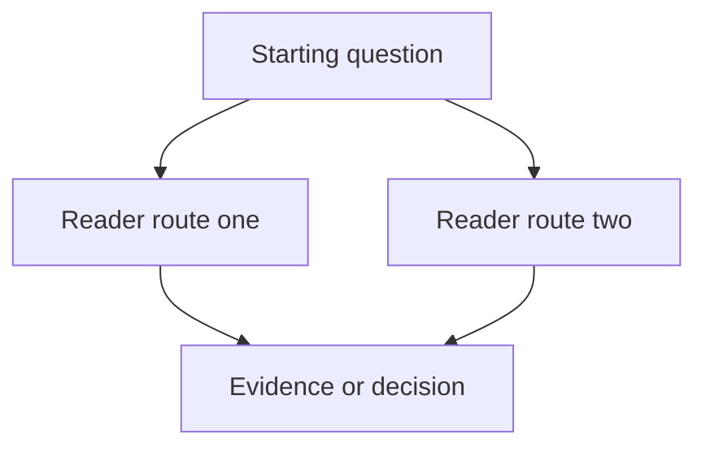

# [Project or topic]

**Status:** Research
**Type:** Project note
**Owner:** TBD
**Closest human:** TBD
**Source/date:** TBD, YYYY MM DD
**Sensitivity:** Level 2
**Confidence:** Open question
**Last updated:** YYYY MM DD

## What this is

[One paragraph orientation for a new reader.]

## Current decision state

1. **Confirmed:** [Current confirmed conclusion or state.]
2. **Uncertain:** [Most important uncertainty or contradiction.]
3. **Next decision:** [Decision, owner, and required evidence.]

## Why it matters

[Business, technical, customer, operational, or risk significance.]

## Important uncertainty

[The most consequential uncertainty, conflicting evidence, or missing decision input.]

## Decision or question map

## Navigate by question

1. **Understand the opportunity:** [Link]
2. **Compare alternatives:** [Link]
3. **Review assumptions and evidence:** [Link]
4. **Inspect implementation or operations:** [Link]
5. **See open decisions and blockers:** [Link]

## Owners and next action

**Decision owner:** [Owner]
**Operational owner:** [Owner]
**Required contributors:** [People or functions]
**Next action:** [Action]
**Blocker:** [Blocker or None]

## Source and revision status

1. [Current working source and date.]
2. [Superseded snapshot or canonical destination if applicable.]

## Evidence

1. [Named source, link, repository path, date, or reproducible observation.]

## Change log

1. **YYYY MM DD:** Created from [source].
